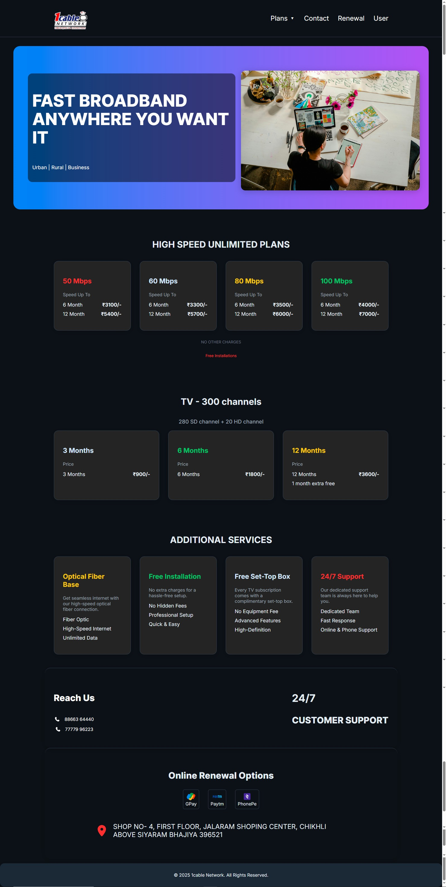
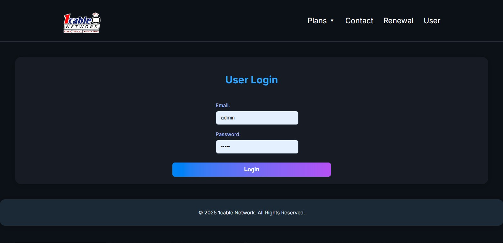
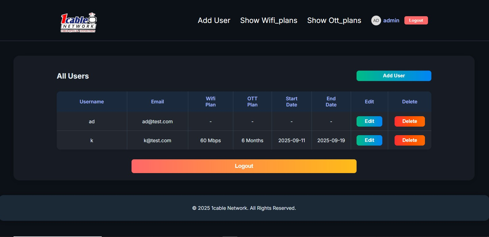

# 1Cable Network - React + Vite (Headless WordPress)

## Overview

1Cable Network is a headless WordPress application with a React (Vite) frontend for managing WiFi and OTT plans, users, and related workflows. The frontend consumes APIs and emphasizes performance, resilience, and modern UX.

## Live site

- Homepage:[ http://1cable-network.infy.uk](https://1cable-network.netlify.app/)

## ScreenShot

## Tech stack

- React 19 + React Router
- Vite 7
- Redux Toolkit + React Redux
- Axios
- Formik + Yup
- PWA via vite-plugin-pwa + Workbox
- Node scripts for image optimization

## Key features

- Code splitting with smart preloading and error-resilient lazy loading
- PWA: offline support, pre-cache, runtime caching for Google Fonts
- Optimized Redux store with persistence, middleware, and dev tooling
- Centralized API client with interceptors, caching, metrics
- Performance monitoring utilities and budgets
- Error boundaries and async error handling
- SEO and social meta tags
- Image optimization utilities and responsive WebP output

## Project structure (selected)

- [vite.config.js](vite-project/vite.config.js)
- [index.html](vite-project/index.html)
- [src/App.jsx](vite-project/src/App.jsx)
- [src/store/index.js](vite-project/src/store/index.js)
- [src/utils/dynamicImports.jsx](vite-project/src/utils/dynamicImports.jsx)
- [src/utils/apiService.js](vite-project/src/utils/apiService.js)
- [src/utils/performanceUtils.js](vite-project/src/utils/performanceUtils.js)
- [src/components/ErrorBoundary.jsx](vite-project/src/components/ErrorBoundary.jsx)
- [src/components/LoadingSpinner.jsx](vite-project/src/components/LoadingSpinner.jsx)
- [public/manifest.json](vite-project/public/manifest.json)
- [public/sw.js](vite-project/public/sw.js)
- [scripts/optimize-images.js](vite-project/scripts/optimize-images.js)
- [.env.example](vite-project/.env.example)
- [.gitignore](vite-project/.gitignore)

## Getting started

### Prerequisites

- Node.js 18+ and npm

### Install

- `npm ci`

### Development

- `npm run dev`
- Open http://localhost:5173

## Environment variables

- Only variables prefixed with `VITE_` are exposed to the client at build time.
- Use [.env.development](vite-project/.env.development) locally, [.env.production](vite-project/.env.production) for builds (keep private).
- Do not commit env files. Patterns are ignored in [.gitignore](vite-project/.gitignore).
- Template: [.env.example](vite-project/.env.example)

## Scripts

- Start dev: `npm run dev`
- Build prod: `npm run build`
- Preview prod: `npm run preview`
- Lint: `npm run lint` / `npm run lint:fix`
- Tests (Vitest if added): `npm run test`
- Optimize images: `npm run optimize-images`

## Build and deploy

### Option A — Build locally and upload `dist`

- Configure [.env.production](vite-project/.env.production) locally (or inline envs)
- `npm run build`
- Deploy contents of `dist/` to your web host

### Option B — Build on server/CI

- Provide `VITE_*` env vars in the CI/host environment
- `npm ci && npm run build`
- Serve `dist/` only

## Performance optimizations

- Code splitting and lazy loading: [dynamicImports.jsx](vite-project/src/utils/dynamicImports.jsx)
  - `createLazyComponent`, preload, retry, smart preloading
- Bundle strategy: vendor and feature chunks: [vite.config.js](vite-project/vite.config.js)
- Performance utils (FCP/LCP/CLS/long tasks, memory, budgets): [performanceUtils.js](vite-project/src/utils/performanceUtils.js)
- Image optimization and responsive WebP:
  - Runtime component: [OptimizedImage.jsx](vite-project/src/utils/OptimizedImage.jsx)
  - Hook: [useImageOptimization.js](vite-project/src/utils/useImageOptimization.js)
  - Script: [optimize-images.js](vite-project/scripts/optimize-images.js)
- Error handling:
  - [ErrorBoundary.jsx](vite-project/src/components/ErrorBoundary.jsx)
  - [AsyncErrorBoundary.jsx](vite-project/src/components/AsyncErrorBoundary.jsx)
  - [PlansErrorBoundary.jsx](vite-project/src/components/PlansErrorBoundary.jsx)
- Loading states:
  - [LoadingSpinner.jsx](vite-project/src/components/LoadingSpinner.jsx)
  - [LoadingSpinner.css](vite-project/src/components/LoadingSpinner.css)

## PWA and offline

- Config: `vite-plugin-pwa` in [vite.config.js](vite-project/vite.config.js)
- Precache/Workbox output: `dist/sw.js`, `dist/workbox-*.js` (built)
- Manifest: [manifest.json](vite-project/public/manifest.json)
- Custom SW (optional advanced strategies): [sw.js](vite-project/public/sw.js)
- Registration and meta (SEO/social/PWA): [index.html](vite-project/index.html)

## API service and caching

- Centralized Axios client with:
  - Auth token header injection from `sessionStorage`
  - Request ID header
  - Response time metrics with [performanceUtils.js](vite-project/src/utils/performanceUtils.js)
  - GET response caching by key with TTL
- File: [apiService.js](vite-project/src/utils/apiService.js)

## State management

- Redux Toolkit store with:
  - Persisted auth slice (`redux-persist`)
  - Performance/error middlewares
  - Dev logger (development only)
- File: [store/index.js](vite-project/src/store/index.js)

## Error monitoring

- Hook points available in [errorReporting.js](vite-project/src/utils/errorReporting.js)
- Wire to Sentry/LogRocket or preferred provider using `VITE_*` envs

## Image optimization workflow

- Place source images in `public/images`
- Run `npm run optimize-images`
- Use [OptimizedImage.jsx](vite-project/src/utils/OptimizedImage.jsx) to serve responsive WebP with fallback

## Security and .env handling

- Never commit secrets. [.gitignore](vite-project/.gitignore) excludes envs.
- Enforce CSP/security headers in your reverse proxy (Nginx/Apache).
- Only `VITE_*` are safe for client exposure.

## Troubleshooting

- Dynamic imports: ensure file extensions are part of the static segment
- PWA build: check `vite-plugin-pwa` section in [vite.config.js](vite-project/vite.config.js)
- Service worker updates: hard refresh, or wait for `autoUpdate`
- Windows ImageMagick: use `magick` command, not `convert`

## Useful docs in repo

- [CODE_SPLITTING_README.md](vite-project/CODE_SPLITTING_README.md)
- [ERROR_BOUNDARIES_README.md](vite-project/ERROR_BOUNDARIES_README.md)
- [IMAGE_OPTIMIZATION_README.md](vite-project/IMAGE_OPTIMIZATION_README.md)

## License

- Proprietary (update if you want to add a license)
